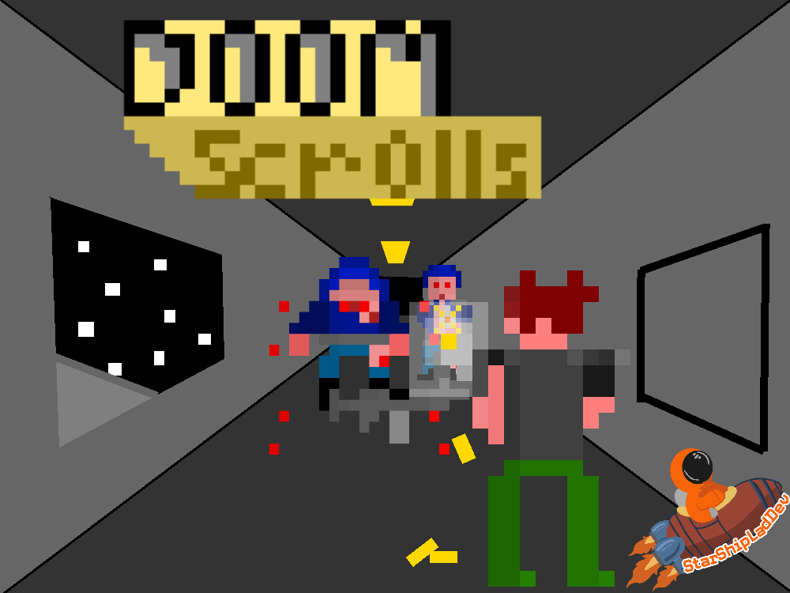
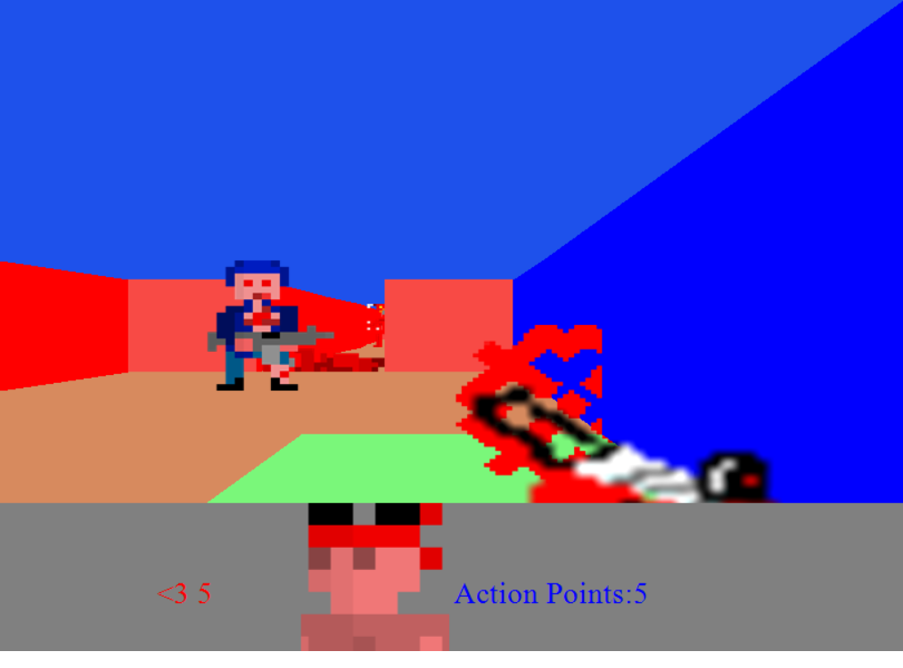

# DoomScrolls -> Retro 3D FPS (Turn-Based)




## Notes/Know Bugs:

> *Important* The serverClients do not currently exit, so the program must be closed from task manager if doing multiplayer, otherwise there is a memory leak *Important*
*Fixed as of 23/01/2021*

> A significant amount of input may result in some commands not being run

>No Turn Limit At The Moment
*Fixed as of 23/01/2021*


## Features(Planned In Brackets)

2+ Player Multiplayer (If you know what IP Address to connect to)
Animated Enemies
Turn-Based FPS combat
Animated Player Weapons
Randomly Generated Weapons
Random Map Generation
(Intractable log files and story)
(Multiple playable resolutions)
Multiple Editable Player Skins
(Save states)

## View of progress
**Displaying user view as 3d boxes**

Below is the process used to draw a '3d' world.


**Displaying user view as 3d boxes, with random color between 'points' to make**
**it look like walls/floors**


**Displaying user view without boxlines, giving a 'real' impression**'


**Displaying user view with scaled (based on distance) sprites**


**Displaying user view with 1:1 window size scaled 'player character view'**


## Latest Build

*23/01/2021 - 0.1a- Gameplay*



## Latest Update Notes:
Text Prompt Update

To Sum Up:

Add Escape key press will exit gameplay

Add Left-arrow key as the 'test' button

Add Test text prompt appearing on left-arrow press


```
	24/03/2021{
		Issues Encountered:
		TextDispaly would draw the Image away from the text.
			This was due to the iamge containign 33% transparent flaot-space. This was resolved by adding
			a 'bump' down where the text is displayed.
		DoomCLoneV2 -> Resources -> Add 'TextBackground' .PNG file to be displayed when text prompts appeared
		DoomCloneV2 -> Overlays -> Add 'Overlays' Folder of classes. This is to store overlay data. May move HUD 
			there.
		DoomCloneV2 -> Overlays -> TextDisplays.cs -> Add class 'TextDisplay'. This is a class that can be called from a 
				draw method, as it has an internal draw method that draws text over the aformentioned 'TextBackground' png.
		Form1.cs -> Add refrence to a TextDisplay instance as 'textDisplay' to be called in UpdateForm();
		Form1.cs->OnKeyUp() -> Add handler for 'left key' pressed. This si to have a key for testing new controls.
				In this case, changing a new bool 'drawPrompt'. When 'drawPrompt' true
				UpdateForm will call 'dispalyText's draw function
			->Add Universal case of 'ESC' Key closing the App, for easier testing and usability

	}
```

## Latest Updates

*24/03/2021 - TextPrompt*


*23/01/2021 - Alpha 'Gameplay' release* 


*20/01/2021 - Animated HUD Alpha* 


*13/01/2021 - Animated Weapon Alpha* 


*09/12/2020 - Menu build*


*29/07/2020 - Map maker*


*15/05/2020 - Multiplayer*


## Next Build ([ ] -Not done , [0] - Half Done , [x] - Done)

End Of June 2021 -Content Build 

* Enemy Variety and attack patterns [0]

* Rehaul of weapon System [0]

* Main Menu [x]

* Full documentation [0]

* Animated Weapons [x]

* Turn limitations (Only x moves per turn, turn ends on shoot ect.) [x]

* Story logs held in computors [0]


## Skill developing

I planned on this project improving my skills in the following:

>Understanding of 3-D representation

>Proof of skill development since 

>C# Code practice

>Correct SDLC practice

>Pixel Art and Animation

## Installing and Compiling:
At the moment, the program can be run by doing the following:

Unzip the "Executable" .ZIP folder.

Unzipping the 'Resources.zip' folder & placing it in the  the 'Executable'folder.

When you run 'DoomScrolls.exe' , a map generator will pop up.
Generate maps until you find one you liek then close the window.

Each turn you have 5 action points. Shooting, moving or turnign will use 1 action point.

Enemies will action after you end your turn or run out of AP. Your AP will then be restored.

Devils fire fireball that cause 10 damage and keep moving.

Gun Soldiers put a target on you. If you are in that cell the next enemy turn, you will take 5 damage.


The *bin/Debug/config.xml* file contains the option to select your server address to connect to and your clientName when you connect.

This file also contains the skin your palyer will use. It mus be a single digit.
Current skins are 

1) Default army skin

2) DanyelDev - [Twitter](https://twitter.com/DevDanyel)

3) CoolJosh3k - [Twitter](https://twitter.com/CoolJosh3k)

4) NerdsipPodcast - [Twitter](https://twitter.com/nerdssippodcast)

5)	Nibby - [Twitter](https://twitter.com/NibbyCodes)

6) Can't Even Bro Avatar - [Twitter](https://twitter.com/CantEvenBro)

7) Rambo - As requested by TikTok user @meth4kids


The program can be run by opening *Executable/DoomCloneV2.exe*

Any resource in *Executable/Resources* can be replaced with a matching file type if the name stays the same.

The IP Address of the server can be found by opening up a command prompt on the server's computor, and typing 'ipconfig'

The Program currently has the following commands:

*ESC* - Exit the game 

*Space* - End your turn. You will be frozen until all connected players have ended their turn.

*W* Move your player Forward

*S* Move your player Back

*A* Move your player Left

*D* Move your player Right

*Q* Replace the gun currently equipped

*O* Start a server on your local ip address

*P* Start a client that connects with the address listed in config.xml

*K* If client created, send a hello message over the network stream

*L* Create a second local client. This client will not perform actions, but act as a faux connection

*V* If they exist, move players[1] to the right

*1* or *Spacebar* Display lines of each cell

*2* Toggle color of cells

*3* Toggle drawing player gun

*4* Toggle displaying debug text

*5* Toggle displaying playerHUD

*6* Toggle outlines of units

*7* Toggle background music playing

To Fire, click on an enemy who is alive. A cursor will appear,
and the next 3-4 clicks will shoot at the centre of the cursor.
You can right click to exit firing.


