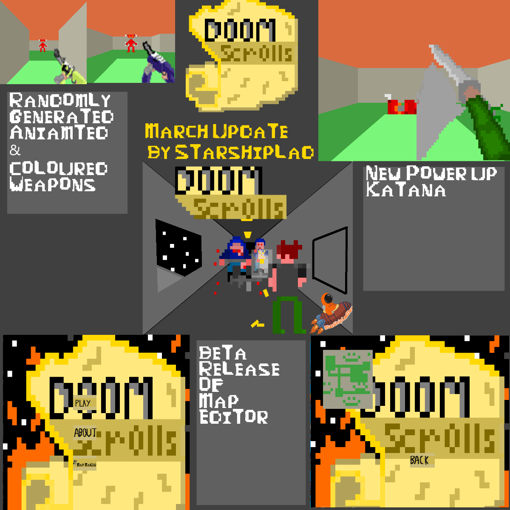

# DoomScrolls -> Retro 3D FPS (Turn-Based)




## Notes/Know Bugs:

> A significant amount of input may result in some commands not being run

> Creating 'unconnected' rooms in the map editor may spawn the player in these, causing the player to e unable to reach the map


## Features(Planned In Brackets)

2+ Player Multiplayer (If you know what IP Address to connect to)
Animated Enemies
Turn-Based FPS combat
Animated Player Weapons
Randomly Generated Weapons
Random Map Generation
(Intractable log files and story)
(Multiple playable resolutions)
Multiple Editable Player Skins
(Save states)

## View of progress
**Displaying user view as 3d boxes**

Below is the process used to draw a '3d' world.


**Displaying user view as 3d boxes, with random color between 'points' to make**
**it look like walls/floors**


**Displaying user view without boxlines, giving a 'real' impression**'


**Displaying user view with scaled (based on distance) sprites**


**Displaying user view with 1:1 window size scaled 'player character view'**


## Latest Build

*23/01/2021 - 0.1a- Gameplay*

## Latest Update Notes:


Katana And Random Gen Weapons Update

CODE TO RUN JSON 

for( z in x.updates){
  document.innerHTML+=(x.updates[z].area + "\n\n");
	for(v in x.updates[z].updateNotes){
		document.innerHTML+=(x.updates[z].updateNotes[v]+" \n");
	}
}

To Sum Up:
	Added a Katana Power up that has replaced the Glock, however both wil lbe usable by next Build
	Added a Bea test version of the map editor
	Added further optimization code
	Added Random camo generation
	Added More Resources
	Added Generic repaint utility method


```
	{
		"date":"06/04/2021",
		"updates":[
				{
					"area":"DoomCloneV2 -> Resources",
					"updateNotes":[
						"Add Katana Animation PNG file",
						"Add ModularCamo Animation PNG files for Gun",
						"Add .WAV Audi files for each combination of heavy bullet, medium bullet, silenced and standard "
					]
				},
				{
					"area":"DoomCloneV2 -> Form1.cs / Form1.cs->DrawCells()",
					"updateNotes":[
						"Add Timespan 'avrageTimeToRunDrawing' that is logged in 'DrawCells()' to better debug draw lag specifically"
					]
				},
				{
					"area":"DoomCloneV2 -> Form1.cs -> FormUpdate() / DrawCells()",
					"updateNotes":[
						"Move section of code in FormUpdate that itterates drawing cells to new method 'DrawCells()' for cleaner code. "
					]
				},
				{
					"area":"DoomCloneV2 -> Form1.cs -> MouseClicker())",
					"updateNotes":[
						"Add handling for nex MpaGen button being pushed and for individual cells being changed to non-mat when clicked and shown. This is to have Map Editor functionality "
					]
				},
				{
					"area":"DoomCloneV2 -> Player.cs -> CreatePowerup()",
					"updateNotes":[
						"Modify Constructor call to take String of power up type, rather than hardcoded 'PUGlock'. This is to have variety of powerups",
						"Add code that repaints RGB of 255,0,225 to Globals.katanaColor before setting Poweup o be that new image. This is so powerups can be customizable"
					]
				},
				{
					"area":"DoomCloneV2 -> Player.cs -> SetPowerUp()",
					"updateNotes":[
						"Add Enum of of all powerup types and method 'SetPowerUp' that calls 'CreatePowerUp' so player object can change power ups"
					]
				},
				{
					"area":"DoomCloneV2 -> Globals.cs",
					"updateNotes":[
						"Add 'katanaColor' static Color that is read in from config.This is to allow sprite customization",
						"Add 'debugTimes' static int that is the total frames that need to be run before average time read out.This is to clear debug log"
					]
				},
				{
					"area":"DoomCloneV2 -> Globals.cs -> FillMapWithEnemies()",
					"updateNotes":[
						"Add Method 'FillMapWithEnemies()' to perform the random placement of random enemeies in map outside of Form1, to allow in-game building of other maps"
					]
				},
				{
					"area":"DoomCloneV2 -> Globals.cs -> GetFreeCell()",
					"updateNotes":[
						"Move method GetFreeCell() to Globals to allow in-game map changing, as map can be built from Globals now rather that Form that is playing"
					]
				},
				{
					"area":"DoomCloneV2 -> Globals.cs -> ReColorImage()",
					"updateNotes":[
						"Add Method ReColorImage() to change specific pixels in a given image.This is to provide easy customization of the sprites used in-game"
					]
				},
				{
					"area":"DoomCloneV2 -> Globals.cs -> FindFirstEntityInDistance()",
					"updateNotes":[
						"Add Method FindFirstEntityInDistance() to return an 'Entity' of a specified type in a line. This is due to the need for a utility method like this"
					]
				},
				{
					"area":"DoomCloneV2 -> Cell.cs -> Cell()",
					"updateNotes":[
						"Modify constructor so left and right wall draw colors are lighter and darker shades of 'drawColor' respectivly, to make nicer looking gameplay"
					]
				},
				{
					"area":"DoomCloneV2 -> Projectile.cs ",
					"updateNotes":[
						"Add 'id' String that is called as created from Unit. This is so individual Porjecticles can be checked/searched without looping through all projectiles"
					]
				},
				{
					"area":"DoomCloneV2 -> CommandReader.cs -> Powerup() ",
					"updateNotes":[
						"Modify Method to take parameter of Player.PowerupType, and handle Katana now. This is to have a range of powerups that can be actioned"
					]
				},
				{
					"area":"DoomCloneV2 -> Guns.cs -> SetComponent() ",
					"updateNotes":[
						"Modify SetComponenet so random color picked, and on selecting base iamge, Globals.ReColorIamge used to rescolour image. This is to have near limitless camos"
					]
				},
				{
					"area":"DoomCloneV2 -> Projectile.cs -> Invert()",
					"updateNotes":[
						"Add 'Invert' Method toinver the xdirection and ydirection Values. This allows the projectile to be 'shot back' if the katana is used"
					]
				}
		],
		"issuesEncountered":{
				"issue":{
					"description":"Pressing 'Q' did no refresh palyer gun, but isntead removed it ",
					"resolution":"Followed code-run path, found weapon needed to be resized via Player.changeGunSize()"
				}
		},
		"ToDo":["Add MapReading","Add more utiliy map functions like sound","Add Tutorial","Add Enemy movement and meele enemy","Add Objective","Move all unit placin to Globals"]
	}
	
```

## Latest Updates

*06/04/2021 - Katana*


*24/03/2021 - TextPrompt*


*23/01/2021 - Alpha 'Gameplay' release* 


*20/01/2021 - Animated HUD Alpha* 


*13/01/2021 - Animated Weapon Alpha* 


*09/12/2020 - Menu build*


*29/07/2020 - Map maker*


*15/05/2020 - Multiplayer*


## Next Build ([ ] -Not done , [0] - Half Done , [x] - Done)

End Of June 2021 -Content Build 

* Enemy Variety and attack patterns [0]

* Rehaul of weapon System [x]

* Main Menu [x]

* Full documentation [0]

* Animated Weapons [x]

* Turn limitations (Only x moves per turn, turn ends on shoot ect.) [x]

* Story logs held in computors [0]


## Skill developing

I planned on this project improving my skills in the following:

>Understanding of 3-D representation

>Proof of skill development since 

>C# Code practice

>Correct SDLC practice

>Pixel Art and Animation

## Installing and Compiling:

At the moment, the program can be run by doing the following:

Unzip the "Executable" .ZIP folder.

Unzipping the 'Resources.zip' folder & placing it in the  the 'Executable'folder.

When you run 'DoomScrolls.exe' , a map generator will pop up.
Generate maps until you find one you liek then close the window.

Each turn you have 5 action points. Shooting, moving or turnign will use 1 action point.

Enemies will action after you end your turn or run out of AP. Your AP will then be restored.

Devils fire fireball that cause 10 damage and keep moving.

Gun Soldiers put a target on you. If you are in that cell the next enemy turn, you will take 5 damage.


The *bin/Debug/config.xml* file contains the option to select your server address to connect to and your clientName when you connect.

This file also contains the skin your player will use. It mus be a single digit.
Current skins are 

1) Default army skin

2) DanyelDev - [Twitter](https://twitter.com/DevDanyel)

3) CoolJosh3k - [Twitter](https://twitter.com/CoolJosh3k)

4) NerdsipPodcast - [Twitter](https://twitter.com/nerdssippodcast)

5)	Nibby - [Twitter](https://twitter.com/NibbyCodes)

6) Can't Even Bro Avatar - [Twitter](https://twitter.com/CantEvenBro)

7) Rambo - As requested by TikTok user @meth4kids


The program can be run by opening *Executable/DoomCloneV2.exe*

Any resource in *Executable/Resources* can be replaced with a matching file type if the name stays the same.

The IP Address of the server can be found by opening up a command prompt on the server's computor, and typing 'ipconfig'

The Program currently has the following commands:

*ESC* - Exit the game 

*Space* - End your turn. You will be frozen until all connected players have ended their turn.

*W* Move your player Forward

*S* Move your player Back

*A* Move your player Left

*D* Move your player Right

*Q* Replace the gun currently equipped

*O* Start a server on your local ip address

*P* Start a client that connects with the address listed in config.xml

*K* If client created, send a hello message over the network stream

*L* Create a second local client. This client will not perform actions, but act as a faux connection

*V* If they exist, move players[1] to the right

*1* or *Spacebar* Display lines of each cell

*2* Toggle color of cells

*3* Toggle drawing player gun

*4* Toggle displaying debug text

*5* Toggle displaying playerHUD

*6* Toggle outlines of units

*7* Toggle background music playing

To Fire, click on an enemy who is alive. A cursor will appear,
and the next 3-4 clicks will shoot at the centre of the cursor.
You can right click to exit firing.


