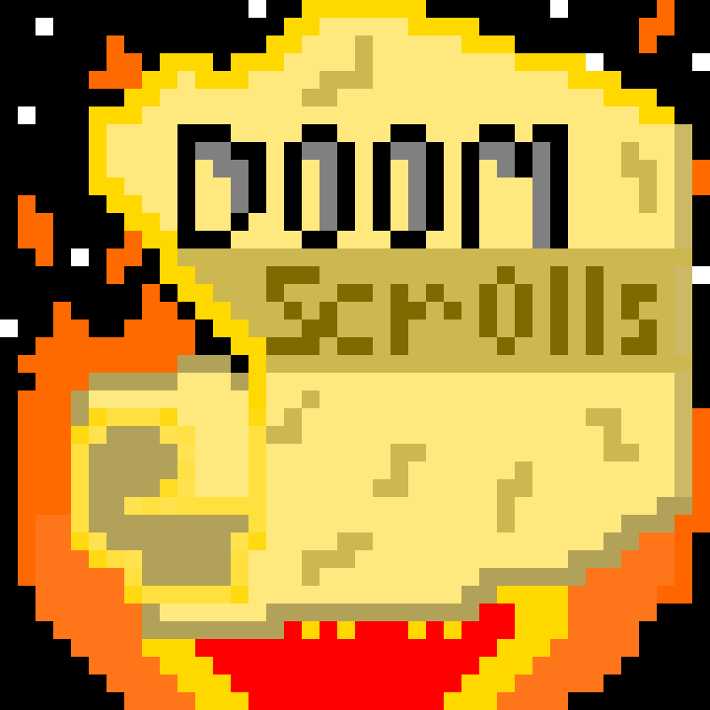
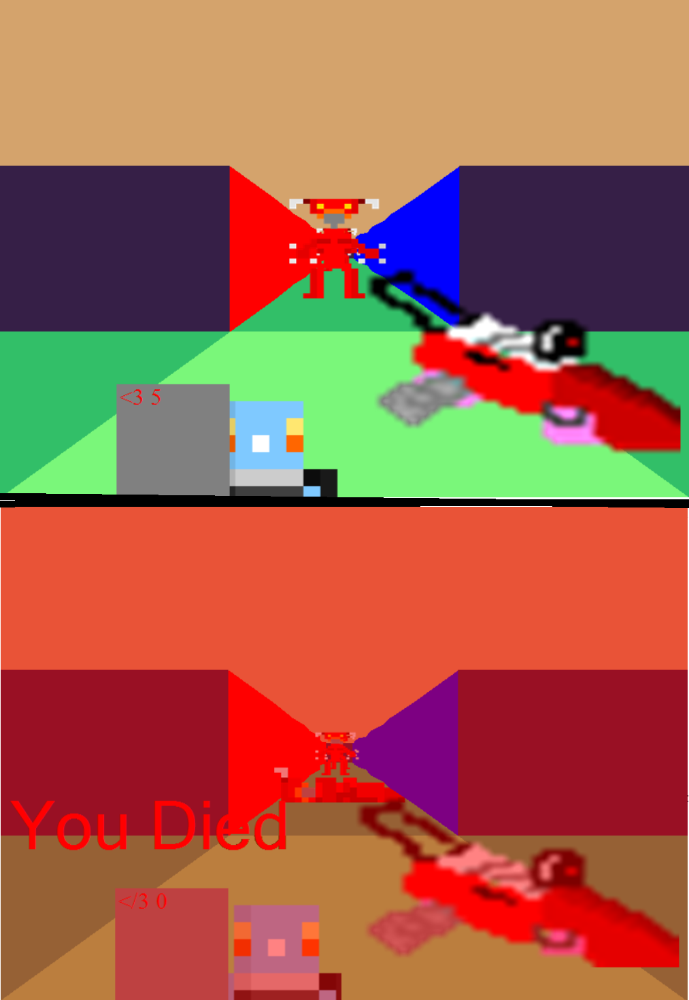
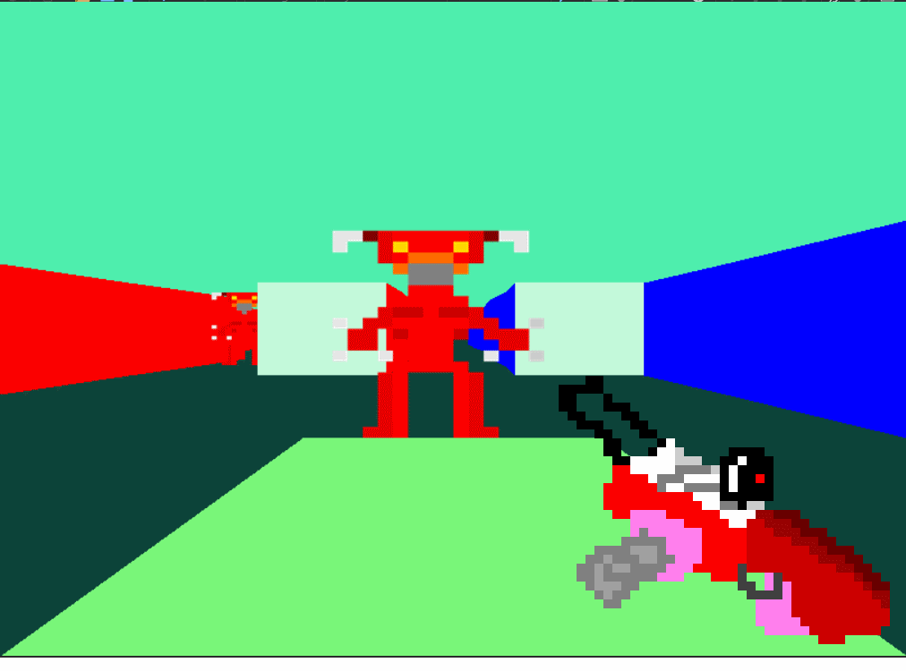
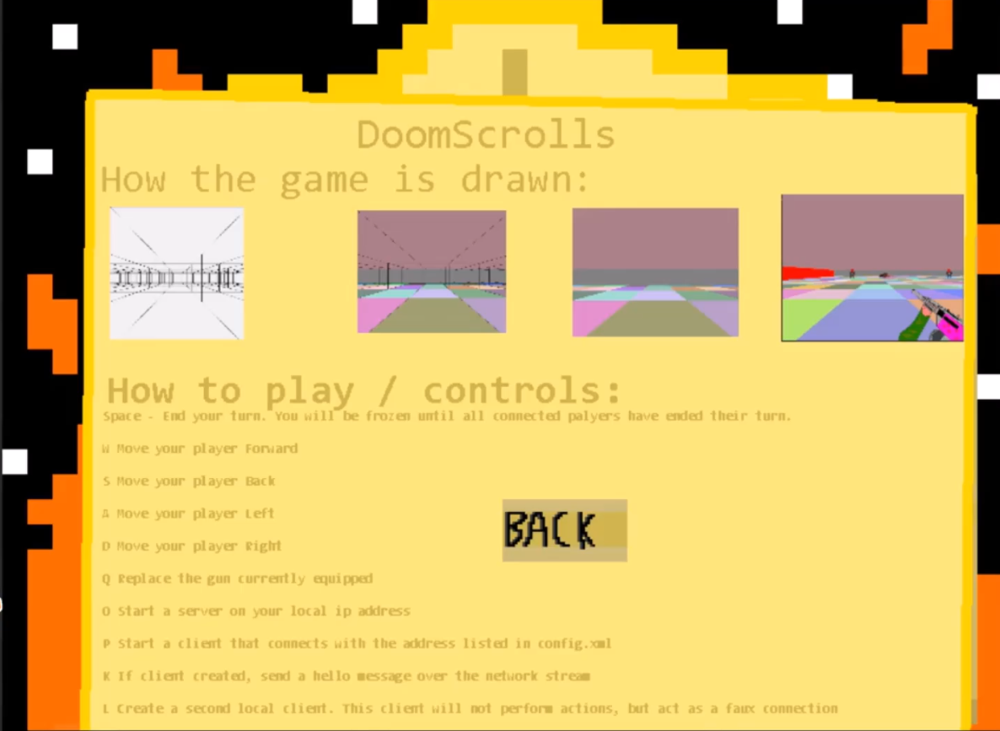

# DoomScrolls -> Retro 3D FPS (Turn-Based)




## Notes/Know Bugs:

> *Important* The serverClients do not currently exit, so the program must be closed from task manager if doing multiplayer, otherwise there is a memory leak *Important*

> A significant amount of input may result in some commands not being run

>No Turn Limit At The Moment


## Features(Planned In Brackets)

2+ Player Multiplayer (If you know what IP Address to connect to)
Animated Enemies
Turn-Based FPS combat (with actual challenge )
Animated Player Weapons
Randomly Generated Weapons
Random Map Generation
(Intractable log files and story)
(Multiple playable resolutions)
Multiple Editable Player Skins
(Save states)

## View of progress
**Displaying user view as 3d boxes**

Below is the process used to draw a '3d' world.


**Displaying user view as 3d boxes, with random color between 'points' to make**
**it look like walls/floors**


**Displaying user view without boxlines, giving a 'real' impression**'


**Displaying user view with scaled (based on distance) sprites**


**Displaying user view with 1:1 window size scaled 'player character view'**


## Latest Build

*29/07/2020 - 0.03a- Map Generation*


## Latest Update Notes:
Animated Weapon Alpha

Sum up :
Added 'Gun's drawImage handling to be an array of individual frames rather than one image so it can be aniamted.
Performed some server handling for better connections
Added a Menu system
Commented some files

```

27/10/2020{

    Server.cs.SendMessage -> Add a condition that if the message equals "KillTheServer", the server will run server.Stop() to stop memory leak
    
    Server.cs.Stop() -> Add condition to close 'thread' array to stop memory leak
    
    DoomCloneV2 -> Add TitleScreen.cs to handle Menu Drawing
    
    DoomCloneV2 -> Add 'Always include' wildcard for all content in 'Resources' folder for further development & modding
    
    DoomCloneV2/Resources -> Rename some dirs so Player.SetComponent can read resources correctly so program works
    
    Player.SetComponent && Gun.buildGun -> Comment out 'Token' component as no longer available
    
    Form1.cs.Form1_FormClosing -> Add this function to 'tidy up' memory leaks caused by unclosed threads when using 'close window'
    
}
08/12/2020{

    Form1.cs -> Add bool 'Menu'. In draw function, while 'menu' true, play main theme and draw the menu .
    This is to add a menu feature to the game
    
    Form1.cs.DrawMenu() -> Added a 'DrawMenu' function to handle drawing the menu
    
    DoomCloneV2 -> Add class 'Menu Item' with draw state and delegated 'onclick' function
    
    DoomCloneV2 -> Separate Major classes into folders such as 'Screens' and 'Threads'
    
    Form1.cs -> Add a MenuItem 'Play'. On click it will
    
    Form1.cs.MouseClicker() -> Add handler so that if menu true, any menuItem under cursor will have its 'onclick' function called
    
    MenuItem -> Rename 'DoomMenuItem' to avoid name conflict with Windows.Forms.MenuItem

}
09/12/2020{

    Form1.cs -> Add 2 more DoomMenuItems - 'About' and 'Back' .
    About sets 'abouton' bool to true, making the 'DrawMenu' function draw the 'About.PNG' image and the 'Back' Menu button.
    'Back' DoomMenuItem sets 'abouton' to false, returning the player to the main menu.
    This is to add more functionality to the menu.
    
    Form1.cs.BeginSession() -> Add Documentation comments for clearer code-readability.
    
    Form1.cs -> Add methods 'SwitchFunc' to toggle function button for the above DoomMenuItems to have functionality.
}
12/01/2021{

    Errors encountered:
    Clipping the animation Frame picture produced and 'Out of Memory' error. The requested sub-sections of the Frame picture
    were adjusted to all be within bounds.

    Gun.cs -> Add 'BuildGunAnimation' Method that returns and array of Bitmaps, so gun drawing can be animated
    
    Gun.cs -> Add 'animation' Bitmap Array so returned gun image can be Bitmap array to animate.
    
    Player.cs -> Modify 'playerView' to be BitmapArray, so gun can be animated
    
    Player.cs -> Creategun() -> Temporarily removed Random Gun gneration, only producing test weapons with code 333 for testing
    
    Player.cs -> Add UpdateGunSize() to Update all 'animation' frames to correct size so they can be called as is
    
    Form1.cs -> StartSession() -> Call 'thispalyer.UpdateGunSize to update gun size at the start
    
}
13/01/2021{

    Errors encountered:
    Playing music would stop as soon as soon as 'BeginSession' ended due to garbage collection.
    This was resolved by moving the changing of the initialization of music as a new SoundPlayer, to changing the source in BeginSession.
    However, this new 'Combat' song playing has been commented out as Soundplayer does not support multiple simultaneous files.
    This would prevent Enemy and Gun sounds.
    https://stackoverflow.com/questions/50074501/music-suddenly-stops-playing-in-c-sharp-windows-form-application

    Form1.cs -> BeginSession() -> At beginning of function, add Game-music beginning to play for audio enhancement.
    
    Gun.cs -> Add Comments Above all functions
    
    Globals -> Add Methods 'StartMusic()' and 'StopMusic()' to manage global audio.
    
    Form1.cs -> Form1() -> Music replaced from a local 'SoundPlayer' to 'Globals.StartMusic()' so music can be globally kept
    outside of garbage collection
    
}
```

## Latest Updates

*20/01/2021 - Animated HUD Alpha* - **Currently in 'Gameplay' branch**



*13/01/2021 - Animated Weapon Alpha* - **Currently in 'Gameplay' branch**



*09/12/2020 - Menu build*



*29/07/2020 - Map maker*


*15/05/2020 - Multiplayer*


## Next Build

End Of December -Content Build  **Delayed from September*

* Enemy Variety and attack patterns

* Rehaul of weapon System

* Main Menu

* Full documentation

* Animated Weapons

* Turn limitations (Only x moves per turn, turn ends on shoot ect.)

* Story logs held in computors


## Skill developing

I planned on this project improving my skills in the following:

>Understanding of 3-D representation

>Proof of skill development since 

>C# Code practice

>Correct SDLC practice

>Pixel Art and Animation

## Installing and Compiling:
At the moment, the program can be run by doing the following:
Unzip the "Executable" .ZIP folder.
Unzipping the 'Resources.zip' folder & replacing the 'Executable's 'Resources' folder with it.

The program can be run by opening *Executable/DoomCloneV2.exe*

Any resource in *Executable/Resources* can be replaced with a matching file type if the name stays the same.

The *bin/Debug/config.xml* file contains the option to select your server address to connect to and your clientName when you connect.

The IP Address of the server can be found by opening up a command prompt on the server's computor, and typing 'ipconfig'

The Program currently has the following commands:

*Space* - End your turn. You will be frozen until all connected players have ended their turn.

*W* Move your player Forward

*S* Move your player Back

*A* Move your player Left

*D* Move your player Right

*Q* Replace the gun currently equipped

*O* Start a server on your local ip address

*P* Start a client that connects with the address listed in config.xml

*K* If client created, send a hello message over the network stream

*L* Create a second local client. This client will not perform actions, but act as a faux connection

*V* If they exist, move players[1] to the right

*1* or *Spacebar* Display lines of each cell

*2* Toggle color of cells

*3* Toggle drawing player gun

*4* Toggle displaying debug text

*5* Toggle displaying playerHUD

To Fire, click on an enemy who is alive. A cursor will appear,
and the next 3-4 clicks will shoot at the centre of the cursor.
You can right click to exit firing.


