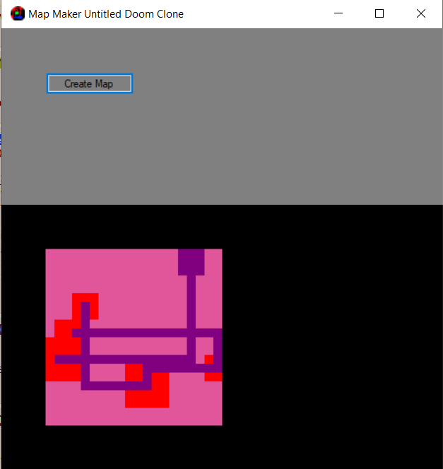

# DoomScrolls -> Retro 3D FPS (Turn-Based)

## Notes/Know Bugs:

> On loading in as client, gun will be oversized. Press 'Q' to generate a new correct-sized gun. FIXED AS OF 28/07/2020

> The serverClients do not currently exit, so the program must be closed from task manager if doing multiplayer

> A significant amount of input may result in some commands not being run

> Walking into projectiles does not cause the projectiles to damage the player

>No Turn Limit At The Moment

## Features(Planned In Brackets)

(Turn Based FPS Combat)
2+ Player Multiplayer (If you know what IP Address to connect to)
Animated Enemies
Turn-Based FPS combat (with acttual challenge )
(Animated Player Weapons)
Randomly Generated Weapons
Random Map Generation
(Intractable log files and story)
(Multiple resolutions)
Multiple Editable Player Skins
(Save states)

## View of progress
**Displaying user view as 3d boxes**

Below is the process used to draw a '3d' world.

**Displaying user view as 3d boxes, with random color between 'points' to make**
**it look like walls/floors**

**Displaying user view without boxlines, giving a 'real' impression**'

**Displaying user view with scaled (based on distance) sprites**

**Displaying user view with 1:1 window size scaled 'player character view'**

## Latest Build

05/06/2020 - 0.02a- Friendship Build

## Latest Update

28/07/2020 Skin Customization and Multiplayer-enabled random Maps. Turn System.

## Next Build

29/07/2020 - Gameplay Build
* Skin Customization via config file
* Synced Turn-based gameplay
* Random Map Generation

## Following Build

End Of September -Content Build

* Enemy Variety and attack patterns

* Rehaul of weapon System

* Main Menu

* Full documentation & display controls

* Animated Weapons

* Turn limitations (Only x moves per turn, turn ends on shoot ect.)

* Story logs held in computors

## Skill developing

I planned on this project improving my skills in the following:

>Understanding of 3-D representation

>Proof of skill development since 

>C# Code practice

>Correct SDLC practice

>Pixel Art and Animation

## Installing and Compiling:
At the moment, the program can be run by doing the following:
Unzip the "Executable" .ZIP folder.
Unzipping the 'Resources.zip' folder & replacing the 'Executable's 'Resources' folder with it.

The program can be run by opening *Executable/DoomCloneV2.exe*

Any resource in *Executable/Resources* can be replaced with a matching file type if the name stays the same.

The *bin/Debug/config.xml* file contains the option to select your server address to connect to and your clientName when you connect.

The IP Address of the server can be found by opening up a command prompt on the server's computor, and typing 'ipconfig'

The Program currently has the following commands:

*Space* - End your turn. You will be frozen until all connected palyers have ended their turn.

*W* Move your player Forward

*S* Move your player Back

*A* Move your player Left

*D* Move your player Right

*Q* Replace the gun currently equipped

*O* Start a server on your local ip address

*P* Start a client that connects with the address listed in config.xml

*K* If client created, send a hello message over the network stream

*L* Create a second local client. This client will not perform actions, but act as a faux connection

*V* If they exist, move players[1] to the right

*1* or *Spacebar* Display lines of each cell

*2* Toggle color of cells

*3* Toggle drawing player gun

*4* Toggle displaying debug text

To Fire, click on an enemy who is alive. A cursor will appear,
and the next 3-4 clicks will shoot at the centre of the cursor.
You can right click to exit firing.
